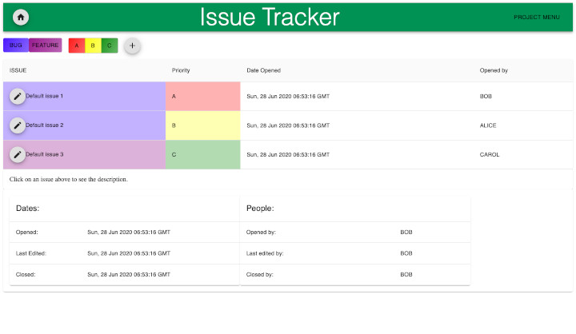

# [Issue Tracker]()
Track issues (bugs and features) for various projects.  

## Purpose/Goal
To draw upon many different skills that I learned and put them all together into one comprehensive project.  
To create an app that helps me keep track of my progress on projects.  
To learn a new style library (Material UI) while attempting a new project.

## Operation
Click on ... to;
* Home icon
    * Go to the dashboard and see all issues for the current project.
* Plus icon
    * Add a new issue to the current project.
* Edit icon
    * Edit the selected issue for the current project.
* Issue entry in issue table
    * See a description and details about the issue below the issue table.
* Priority buttons
    * Filter the issues in the table.
* Bug button
    * See the bugs for the current project.
* Feature button
    * See the features for the current project.

## Tech/Libraries Used
* HTML
* CSS
* JavaScript
* React
* MongoDB
* Express
* AWS Lightsail
* Material-UI

## Problems/Solutions
* Redux was a huge pain, but I figured it out. I will add the links that helped me to figure it out later.
* Working late, running on empty, and with many distractions is a bad idea. Making software requires concentration and family needs to understand that when you are working, they should not bother you. When working on software, you hold many small details in your head and the smallest distraction can break your concentration and it can take several minutes to get back up to speed. This becomes a serious issue when you are distracted every 2-3 minutes with little things.  
* It is important to have a development environment separate, but easily switched between, a production environment when working with databases and pushing to a server with different endpoints. I figured out how to switch between them more easily by simply changing the "env" setting in the express app and writing convenience scripts to restart the server app when I make a change. This way I can edit things using my localhost connection (which I still haven't figured out why it doesn't allow me to use redirects) and quickly test them out on the live server app.

## More Information
Initial idea for the color palette; [Color Palette](https://paletton.com/#uid=72L1v0kYO++d5FSpKAmVit9++ka)  
Read [progress.md](progress.md) to see a timeline of the app's development.
